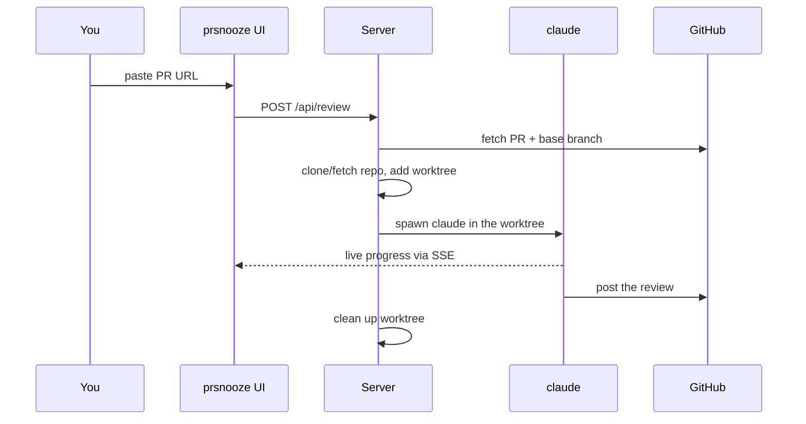

# prsnooze

**Get your pull requests reviewed while everyone else is asleep.**

You paste a GitHub PR URL. prsnooze reads the diff, reviews it, and posts the comments back to the PR — without waiting for a human. It runs on a teammate's laptop and reviews as them.


## Why it's different from a generic linter

- **It uses your project's own review rules.** Drop a `review-pr/SKILL.md` into any repo's `.claude/skills/` and prsnooze runs *that* playbook on every review. Different repos can have different standards. [See how](#reviews-follow-your-projects-rules).
- **It's a real read of the code, not a regex.** Under the hood it's Claude Code running headlessly, so the reviewer actually opens files, follows references, and understands context.
- **Small, safe PRs get auto-approved.** A risk-score gate approves clean PRs and comments on risky ones. Auth, payments, and migration changes always get a human eyeball. [See how](#how-auto-approve-decides).

## The change in workflow

| Before | After |
|---|---|
| "Hey, can you review my PR?" | Paste the PR URL. Done. |
| Wait hours for a human | First-pass review in under a minute |
| Reviewer context-switches | Reviewer is asleep and never interrupted |

prsnooze doesn't replace a human on risky changes. It clears the "this is probably fine" pile so humans spend attention where it matters.

## ⚠️ Before you install: safety

prsnooze runs `claude --dangerously-skip-permissions`. That means Claude has full file and network access inside the worktree with **no confirmation prompts**, and anyone who can reach the web UI can trigger a Claude session on your machine.

To run it safely:

1. **Don't expose the URL to the public internet.** LAN or Tailscale only. There's no built-in auth.
2. **Use a fine-grained GitHub token**, scoped to just the repos you want reviewed. Not a classic all-repos PAT.
3. **Read your review skill before trusting it.** It's what actually posts on GitHub.
4. **Run it on a machine you're OK issuing actions from.**

Reviews are posted as *the machine's* GitHub user. If someone else uses your prsnooze, they're reviewing as you.

## Quickstart

### Docker (recommended)

Everything bundled: Node, git, `gh`, Claude Code.

```sh
git clone https://github.com/mahsanamin/prsnooze.git
cd prsnooze
bin/docker-server start          # build + start in background
bin/docker-server claude-login   # one-time: complete Claude OAuth
bin/docker-server gh-login       # one-time: gh auth (use a fine-grained PAT)
```

Open **http://localhost:8284**.

Auth and data persist in docker volumes (`prsnooze-claude`, `prsnooze-gh`, `prsnooze-data`), so rebuilds don't wipe your login.

Common commands:

| Command | Does |
|---|---|
| `bin/docker-server start` | Build if needed, start in background |
| `bin/docker-server stop` | Stop the container |
| `bin/docker-server restart` | Restart without rebuild |
| `bin/docker-server rebuild` | Rebuild image, recreate container |
| `bin/docker-server logs` | Tail logs |
| `bin/docker-server ssh` | Shell into the container |

Each is also `npm run docker:<command>`.

### Local (no Docker)

You'll need Node ≥ 20, `git`, `claude` (logged in), `gh` (authenticated), and SSH access to GitHub.

```sh
git clone https://github.com/mahsanamin/prsnooze.git
cd prsnooze
npm install
npm start
```

`npm start` runs preflight checks and starts the server. Runtime data lives in `~/.prsnooze/`.

## How it works



The worktree is a full checkout, so `CLAUDE.md`, `AGENTS.md`, and everything under `.claude/` in your repo are picked up automatically.

## Reviews follow your project's rules

**This is the feature that makes prsnooze useful in practice.** Every project you use it on can have its own review playbook, and prsnooze runs whichever one applies.

At review time, prsnooze looks for a `SKILL.md` in this order (first hit wins):

1. `<repo>/.claude/skills/aa-review-pr/SKILL.md` — project-specific
2. `<repo>/.claude/skills/review-pr/SKILL.md` — same, alternate name
3. `~/.claude/skills/aa-review-pr/SKILL.md` — your personal playbook
4. `~/.claude/skills/review-pr/SKILL.md`
5. `skills/default-review/SKILL.md` — the bundled default (always exists)

The web UI tags each review with which one ran: `[project]`, `[user]`, or `[bundled]`.

**To give one of your repos its own rules:** drop a `review-pr/SKILL.md` into `.claude/skills/` in that repo. Next time someone submits a PR from it to prsnooze, that skill will drive the review. The bundled default is a solid starting point to copy and customize.

## How auto-approve decides

Auto-approve fires (`gh pr review --approve`) only when **all** of these are true:

1. `AUTO_APPROVE=true` in config.
2. No critical or major findings.
3. **Risk score ≤ 20.**

The reviewer computes a 0–100 score from the diff. Auth, payments, and DB migration changes each add +50 — enough to always block auto-approve on top of a reducer cap that keeps them from being explained away. Smaller signals like patch dep bumps or a matching test change move the score around.

The score follows a full rubric — categories, weights, reducers, thresholds. If you want the details:

<details>
<summary><strong>Full scoring rubric</strong> (click to expand)</summary>

**Step 1 — Detect red-flag hits (real behavior changes, not adjacency).**

A typo fix in `AuthService` is *not* an auth hit. Removing a permission check *is*. A `--` comment in a migration file is *not* a migration hit. New DDL *is*. Adjacency doesn't count — only real behavior changes.

**Step 2 — Score.**

| Category | Weight |
|---|---|
| Auth / payments / DB migration | +50 each |
| CI/CD, public-API break | +30 each |
| Real refactor | +20 |
| New endpoint / public API added | +20 |
| Dep bump — major / minor / patch | +25 / +10 / +2 |
| Unbounded blast radius (per unclear scope) | +15 |

**Reducers (subtract):**

| Signal | Reduction |
|---|---|
| Diff is comments / formatting / renames only | −25 |
| Diff is test-files or docs only | −20 |
| Matching-name test files also changed | −15 |
| New tests added exercising the changed paths | −10 |

**Reducer cap.** When auth/payments/migration fires, reducers can subtract at most −20 total. A real top-3 change never auto-approves.

**Step 3 — Decide.**

| Score | Action |
|---|---|
| ≤ 20 | `--approve` |
| 21 – 60 | `--comment` |
| > 60 | `--comment` with a ⚠️ high-risk banner |

Any critical or major finding overrides the score → `--comment`.

The reviewer emits one line the UI parses:
```
APPROVAL: comment — score=50, hits=[T1], reducers=[]
```

**Override — "when in doubt, comment."** If uncertain, err toward hitting a category and toward unbounded. Missing an approval is much cheaper than approving something risky.

</details>

## Manual approve (for PRs the bot didn't approve)

When a PR comes back as a comment (score too high, or human eyeball warranted), you can approve it manually from the UI. It's password-gated so it works whether you're on `localhost` or reaching prsnooze through a proxy.

<details>
<summary><strong>How manual approve works</strong></summary>

- Set `PRSNOOZE_ADMIN_PASSWORD` in your `.env` to enable it. Leave it unset and the button is disabled.
- Click the **🔒 Locked** chip, enter the password → the browser is **🔓 Unlocked** for 1 hour (signed HttpOnly cookie, no server-side session).
- The password is checked server-side only. Wrong guesses are rate-limited per IP: 5 in a row locks the endpoint for 1–30 minutes.
- Unlock is per browser and per URL. `localhost` and your proxy hostname unlock independently.
- **✓ Approve PR** runs `gh pr review <url> --approve` under the machine's `gh` login. It's disabled for PRs you authored.

</details>

## Configuration

Defaults live in `.env.example`. Copy it to `.env` to override.

| Variable | Default | What it does |
|---|---|---|
| `PORT` | `8284` | HTTP port |
| `AUTO_APPROVE` | `true` | Turn auto-approve off entirely |
| `CONFIDENCE_THRESHOLD` | `80` | Drop findings below this confidence. Set to `0` to keep everything. |
| `SKIP_IF_ALREADY_REVIEWED` | `true` | Don't re-review the same commit SHA |
| `PRSNOOZE_ADMIN_PASSWORD` | (unset) | Password for manual approve. Unset = feature disabled. |
| `MAX_CONCURRENT_REVIEWS` | `1` | How many reviews run in parallel |
| `KEEP_WORKTREES_ON_SUCCESS` | `false` | Keep worktrees around after success (debugging) |
| `HERO_IMAGE` | `/heroes/sleepy-cat.svg` | Home page banner |
| `PRSNOOZE_HOME` | `~/.prsnooze` | Where clones and worktrees live |
| `CLAUDE_BIN` | `claude` | Path to the claude CLI |

## GitHub authentication

prsnooze posts reviews **as the machine's `gh` user.** Use the smallest token that works:

- **Fine-grained PAT** (recommended): https://github.com/settings/personal-access-tokens
  - Scope to specific repos
  - Permissions: **Pull requests: Read and write** + **Contents: Read**
- Set it via `gh auth login` → "Paste an authentication token"
- Avoid classic PATs — they touch everything.

If you clone over SSH (local mode), your SSH key needs to be registered at https://github.com/settings/keys.

## More topics

<details>
<summary><strong>Test-file detection</strong> (what counts as a test)</summary>

Files matching any of these are treated as test code (used in the prod/test breakdown and the matching-name reducer):

- `tests/`, `test/`, `__tests__/`, `spec/`, `e2e/`, `cypress/`, `integration-tests/`, `src/test/`
- `*.test.{js,jsx,ts,tsx,mjs,cjs}`, `*.spec.{js,jsx,ts,tsx,mjs,cjs}`
- `*_test.go`
- `test_*.py`, `*_test.py`
- `*_spec.rb`
- `*Tests.{java,kt,scala,groovy}`, `*Test.…`, `*Spec.…`, `*IntegrationTests.…`

Everything else is production code. Edit `TEST_PATH_PATTERNS` in `lib/github.js` for non-standard layouts.

</details>

<details>
<summary><strong>Concurrent reviews</strong></summary>

One review at a time by default; extras queue FIFO. Set `MAX_CONCURRENT_REVIEWS=3` to run three at once. Each gets its own worktree; only the quick per-repo git prep is serialized so same-repo reviews don't race on the shared clone.

</details>

<details>
<summary><strong>Change the home-page banner</strong></summary>

Three SVG defaults ship in `public/heroes/`:

| Path | Style |
|---|---|
| `/heroes/sleepy-cat.svg` | Orange tabby under stars (default) |
| `/heroes/pink-panther.svg` | Pink long-cat. "cool. calm. reviewing." |
| `/heroes/moon-night.svg` | Crescent moon with hills |

Point at one via `HERO_IMAGE=/heroes/pink-panther.svg`, or drop your own JPEG/PNG/SVG into `public/heroes/` and reference it. Any public URL works too. Landscape aspect ratio recommended.

</details>

<details>
<summary><strong>Troubleshooting</strong></summary>

- **`gh pr view failed`** → run `gh auth status` (or `bin/docker-server ssh` first for Docker).
- **`Base branch not found on origin`** → the PR's base branch was deleted, or your cached clone is stale.
- **Claude exits non-zero** → the worktree is preserved at `~/.prsnooze/worktrees/<jobId>`. `cd` in and run `claude` interactively to reproduce.
- **Review feels generic** → prsnooze fell back to the bundled skill. Check the UI's `skill_resolved` tag. Add a `review-pr/SKILL.md` to your project's `.claude/skills/` for a project-specific rubric.

</details>

<details>
<summary><strong>File layout</strong></summary>

| Path | Purpose |
|---|---|
| `bin/start.js` | Local preflight + bootstrap |
| `bin/docker-server` | Docker dispatcher |
| `Dockerfile`, `docker-compose.yml` | Container definition |
| `server.js` | Express app, SSE + WebSocket, queue wiring |
| `lib/queue.js` | Concurrency-capped worker pool |
| `lib/repo-lock.js` | Per-repo git serialization |
| `lib/review-job.js` | Per-job orchestrator |
| `lib/git-ops.js` | git clone/fetch/worktree wrappers |
| `lib/github.js` | PR URL parser + `gh` wrappers |
| `lib/skill-resolver.js` | Finds the review skill |
| `lib/claude-runner.js` | Spawns `claude`, parses stream-json |
| `public/` | Web UI (vanilla JS, SSE + WebSocket) |
| `~/.prsnooze/` or `prsnooze-data` volume | Runtime state |

</details>

## Roadmap

- GitHub webhook (auto-trigger on PR open)
- Optional bearer-token auth on the web UI
- Persistent queue (survive restart)
- Pluggable skill names via env

## License

[MIT](LICENSE).
