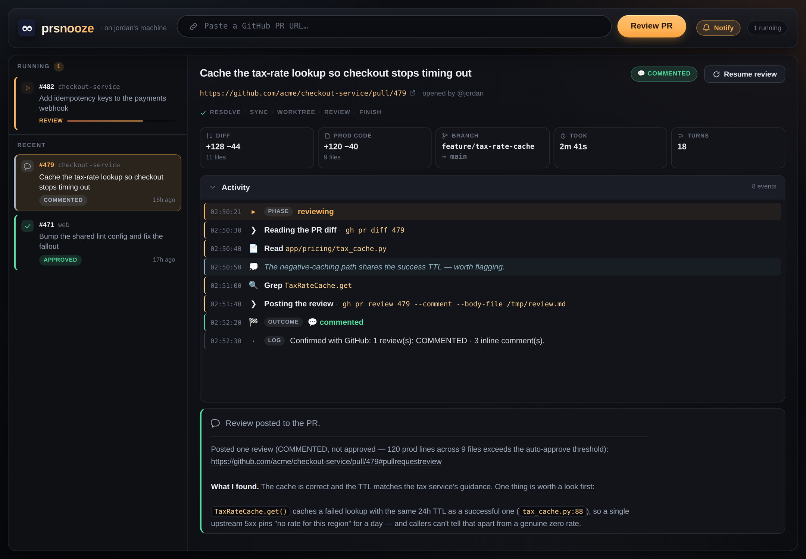
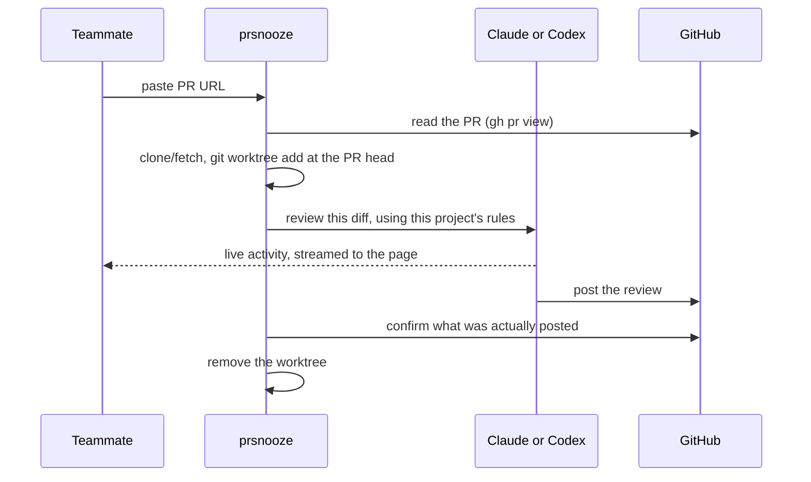

# prsnooze

> **Paste a PR link. Get a real review on GitHub about a minute later.** Nobody had to be asked.



## The problem

Your PR is ready. You drop it in Slack: *"anyone free to review this?"*

Then you wait. Not because the review is hard — because getting a person's attention is hard. They're in a meeting, heads-down, or asleep. A ten-minute review takes half a day to *start*.

## What prsnooze is

One person on your team runs prsnooze on their machine. It's a web page.

Anyone on your network opens that page, pastes a GitHub PR URL, and clicks **Review PR**. A minute later the review is on the PR — specific comments about the actual diff, posted under that person's GitHub account. If the change is genuinely small and safe, it approves it outright.

| Before | After |
|---|---|
| "Can someone review my PR?" → wait | Paste the link. Done. |
| Hours before the first look | First-pass review in about a minute |
| Your reviewer context-switches out of their work | Your reviewer isn't interrupted at all |
| Review quality depends on who's free | Every review runs the same playbook — your project's own |

## Why not just buy a review bot

**Because your team is already paying for Claude or Codex, and that budget is sitting idle.**

prsnooze doesn't have its own account, key, or bill. It drives the Claude Code or Codex CLI that the host is already logged into, using their existing subscription on their own machine. Pick the reviewer from the page. Nothing new to buy, no per-PR metering, no finance conversation.

It's also not an autonomous agent wandering your repos. It runs when a human asks, on the one PR they named, and stops. You can watch every command it runs, live.

| | A hosted review bot | prsnooze |
|---|---|---|
| Cost | org API key, billed per PR | nothing extra, uses the Claude or Codex plan you already have |
| Runs when | on every push, whether you wanted it or not | when someone pastes a link |
| Reviews against | its own generic idea of "good code" | your project's review skill and repository guidance |
| Your code goes | to a third-party service | nowhere — it's your teammate's laptop |

## Try it in two minutes

```sh
git clone https://github.com/mahsanamin/prsnooze.git
cd prsnooze
npm install
npm start
```

`npm start` checks your setup, tells you anything that's missing, and prints a URL — by default **http://localhost:8284**. Open it, paste a PR link, watch it work.

That command runs in your terminal, so it stops when you close it. Once it's working, one more command keeps it up for good, through crashes and reboots: `bin/prsnooze-service install` ([Keep it running](#keep-it-running)).

That's the whole thing. To let colleagues use it, share that URL over your LAN or Tailscale — but read the next section first.

## ⚠️ Read this before you share the URL

prsnooze runs the selected provider without approval prompts or a sandbox. For Claude that is `--dangerously-skip-permissions`; for Codex it is `--dangerously-bypass-approvals-and-sandbox`. That means:

- The reviewer can read, write and run anything inside the checkout, with no confirmation prompts.
- **Anyone who can reach the page can start an AI review session on your machine.**
- Reviews are posted as *you*. Anyone using it is reviewing under your GitHub identity.

So:

1. **Don't put it on the public internet.** LAN or Tailscale only. There is no login on the page.
2. **Use a fine-grained GitHub token** scoped to the repos you actually want reviewed (Pull requests: read+write, Contents: read). Not a classic all-repos token.
3. Run it on a machine you don't mind seeing network activity from.

## Keep it running

`npm start` lives in your terminal. Close the window, sleep the laptop, reboot the machine, and prsnooze is gone until someone remembers to start it again. One command fixes that for good:

```sh
bin/prsnooze-service install
```

That hands prsnooze to the machine's own supervisor (launchd on macOS, systemd on Linux). It starts by itself at login or boot, comes straight back if it crashes, and writes to `~/.prsnooze/logs/server.log`.

After that, everything is one command:

| command | what it does |
|---|---|
| `bin/prsnooze-service start` | start it if it isn't already up |
| `bin/prsnooze-service stop` | stop it, however it was started |
| `bin/prsnooze-service restart` | bounce it, which is what to run after editing `.env` |
| `bin/prsnooze-service status` | up or down, on what URL, and what is supervising it |
| `bin/prsnooze-service logs -f` | follow the log |
| `bin/prsnooze-service install` | hand it to launchd/systemd (safe to re-run) |
| `bin/prsnooze-service uninstall` | undo that |

All of them also work as `npm run service:<command>`.

**Running one twice is not a mistake.** `start` on a server that is already up prints the URL and changes nothing: it never binds a second time and never kills the one already working. Plain `npm start` does the same, so the person who forgot it was running gets *"prsnooze is already running at http://…"* instead of a stack trace. Two servers reviewing the same PR is the failure this prevents.

A few host-specific things worth knowing:

- **macOS**: launchd user agents start at *login*, not at power-on. If the machine reboots unattended and nobody logs in, nothing is listening. Turn on automatic login (System Settings → Users & Groups) for a machine your team relies on.
- **Linux**: user services stop at logout unless lingering is on. `install` enables it for you; if it can't, it tells you the `sudo loginctl enable-linger` line to run. The macOS path is the one that's been run end to end so far, so if systemd misbehaves on your box, please open an issue.
- **Docker**: nothing to install. `docker-compose.yml` already says `restart: unless-stopped`, so `bin/docker-server start` survives reboots as long as Docker itself starts with the machine.
- **Git works without your terminal, by design.** prsnooze clones into its own `~/.prsnooze/repos/` over HTTPS, using the token `gh` is already authenticated with. A service gets its own empty ssh-agent and never the loaded one from your shell, so anything depending on an SSH key would work when you test it by hand and fail every night. There is no key in this path to be missing. `bin/prsnooze-service doctor` runs the checks the same way the service sees them, if you ever want to be sure.
- **Settings live in `.env`, not your shell profile.** A service doesn't read your shell. `install` records the `PATH` it saw (so `claude`, `gh` and `git` stay findable) along with `PORT` and `PRSNOOZE_HOME` if you set them, so re-run `install` after moving any of those tools.

## Everyone can see what's left of your plan

Claude reviews come out of one person's subscription, so the top bar shows how much of it is still there. Codex reports token use for each completed review, but does not expose the same plan-window report through its documented non-interactive interface, so the plan meter is hidden while Codex is selected.

It's deliberately visible to everyone, not just the host: whoever is about to paste a PR link is the person spending the plan, and "the session limit resets at 9pm" is a much better answer than a review that mysteriously fails. The numbers come from the CLI's own `/usage` report, which costs nothing to ask for — no tokens, no API call.

The same panel ends with a month-to-date total — *6 reviews · ≈$11.49 at API rates* — read from prsnooze's own review history. That one is a total, not a limit: Claude's plan resets by session and by week, so there's no monthly tank to run dry. It's there to answer "how much has this thing actually eaten of my plan this month".

If the host's `claude` runs on an API key instead of a subscription there are no plan windows to report, and the meter simply doesn't appear.

## The model doing the reviewing is on screen

Claude reviews use the host CLI's selected model, which the page reads from `/model`. Codex also uses its CLI default unless `CODEX_MODEL` is set. An explicit Codex model can be shown before a run; otherwise prsnooze records the concrete model from Codex's own session record when the review finishes.

It's there because it's the shortest explanation of how a review reads: the same PR comes back very differently on Haiku than on Opus. Each finished review also keeps the model it actually ran on in its stats, so a review from last month still tells you what read that diff after the host has moved on to something else. Changing it is a host-side thing through the provider CLI or `CODEX_MODEL`, not a control on this page.

## What it does, step by step



Because it reviews inside a real checkout of your repo, repository guidance such as `CLAUDE.md` and `AGENTS.md` is available to the selected provider.

The worktree is checked out at **the PR's head commit**, so a file the reviewer opens is the code as proposed, and the `file:line` links in the review point at lines that actually exist there. prsnooze does that fetch and checkout itself before the selected provider starts, and tells the reviewer not to move the checkout. With Claude, a `permissions.ask` rule in the reviewed repo still refuses that action because a headless run has nobody to answer it.

For the same reason prsnooze marks its own clones under `~/.prsnooze/repos/` as trusted workspaces in `~/.claude.json` — the one-time dialog that normally grants that only appears in an interactive session, and until it's answered claude silently ignores the reviewed repo's `permissions.allow` list and its project-level skills. It's written once per repo, it never creates the file, and it steps aside if claude is mid-write. `PRSNOOZE_TRUST_CLONES=false` turns it off.

## When it approves on its own

Auto-approve (`AUTO_APPROVE=true`, the default) fires only when **all** of these hold:

1. The reviewer found no critical and no major issues.
2. Its **risk score** for the diff is ≤ 20.
3. Nothing in the diff looks like a real behaviour change in a scary place.

How the score works — the reviewer looks for genuine behaviour changes, not just scary-looking filenames (a typo fix in an auth file is not an auth change):

| Signal | Score |
|---|---|
| Auth / payments / DB migration — real behaviour change | +50 each |
| CI/CD change, public API break | +30 each |
| Real refactor, or a new public endpoint | +20 each |
| Dependency bump — major / minor / patch | +25 / +10 / +2 |
| Unclear blast radius | +15 |
| *Comments, formatting or renames only* | −25 |
| *Tests or docs only* | −20 |
| *Matching test file also changed* | −15 |
| *New tests covering the changed paths* | −10 |

| Total | What it does |
|---|---|
| ≤ 20 | approves |
| 21 – 60 | comments |
| > 60 | comments, with a high-risk banner |

If auth, payments or a migration really changed, the reducers are capped at −20 — so a genuine top-3 change never auto-approves. When it can't tell, it comments. Set `AUTO_APPROVE=false` and it never approves anything.

## Reviews follow your project's rules

prsnooze looks for a review playbook in provider-specific project and user locations, then uses its bundled fallback:

1. Claude: `<repo>/.claude/skills/review-pr/SKILL.md`, then the matching user-level path.
2. Codex: `<repo>/.agents/skills/review-pr/SKILL.md` or `.codex/skills/review-pr/SKILL.md`, then matching user-level paths. Claude locations remain compatibility fallbacks.
3. `skills/default-review/SKILL.md`, bundled here so there is always a floor.

(`aa-review-pr` works as an alternate name at both levels.) The page shows which one ran, tagged `[project]` / `[user]` / `[bundled]`. To make reviews match how your team actually reviews, drop a `review-pr/SKILL.md` into your repo — nothing else to configure.

Provider integrations use a small adapter contract, so adding another reviewer does not change the queue, job lifecycle, persistence, or browser. See [Provider adapters](docs/provider-adapters.md).

## Someone replied to the review — now what

Open the finished review and press **Resume review**. It continues the same provider session, so it already knows what it said the first time. A Claude review always resumes in Claude and a Codex review always resumes in Codex.

A resume can approve. Once nothing is left open, it re-scores the current head against the same table above and posts the verb that comes out, so a small PR whose findings the author fixed gets approved instead of sitting there forever. Fixing the findings doesn't buy down the score, though: a change that touches auth, a migration or CI/CD is still high-risk after the fixes land, so it comments again and the merge call stays with you.

Before it runs, it checks whether that's worth doing and tells you: *"2 new commits and 3 replies to your comments since your review."* If there's nothing new, or the PR is already approved, it says so — **Force resume** runs it anyway. On a merged or closed PR, force is disabled: there's no PR left to review.

## Setup, properly

| | Local | Docker |
|---|---|---|
| Node.js ≥ 20 | you need it | bundled |
| Claude Code or Codex CLI, logged in | you need at least one | both bundled, use `claude-login` and/or `codex-login` |
| `gh` CLI, authenticated | you need it | bundled — `bin/docker-server gh-login` |
| git | you need it | bundled |
| An SSH key | not needed — it clones over HTTPS with the gh token | same |
| Staying up after a reboot | `bin/prsnooze-service install` | already on (`restart: unless-stopped`) |

For local development, Node `22.23.1` is pinned in both `.nvmrc` and
`.tool-versions`. Run `nvm install` (and then `nvm use`), or use `asdf install`
or `mise install` after configuring that manager's Node.js plugin/backend. Node
20 remains supported by the package and CI compatibility matrix.

`bin/prsnooze-service install` records the absolute path of the `node` active
at install time so the supervisor can find it after login or reboot. Changing
the version-manager pin does not change an existing service; run the install
command again from a shell using the desired Node version to update it.

Docker is the easier route for a machine several people will use, since it brings its own `node`, `git`, `gh`, Claude Code, and Codex CLI:

```sh
bin/docker-server start          # build + run in the background
bin/docker-server claude-login   # once: sign in to Claude
bin/docker-server codex-login    # once: sign in to Codex
bin/docker-server gh-login       # once: gh auth (paste a fine-grained PAT)
```

Then open **http://localhost:8284**. Other commands: `stop`, `restart`, `rebuild`, `logs`, `status`, `ssh`, `url` — all but `url` also work as `npm run docker:<command>`. Logins and cached repos live in docker volumes, so `rebuild` doesn't sign you out.

The image installs exact provider versions from `docker/providers/package-lock.json`.
Dependabot proposes CLI upgrades as reviewable changes, so rebuilding the same
commit cannot silently change an adapter's JSON schema. `bin/docker-server
status` prints the versions actually running in the container.

Runtime data (clones, worktrees, past reviews) lives in `~/.prsnooze/`, outside the project. When it runs as a service, its log is there too, at `~/.prsnooze/logs/server.log`.

## Configuration

Everything has a working default. Copy `.env.example` to `.env` only if you want to change something.

| Variable | Default | What it does |
|---|---|---|
| `PORT` | `8284` | HTTP port |
| `AUTO_APPROVE` | `true` | Allow it to approve clean, low-risk PRs. `false` = always just comment. |
| `MAX_CONCURRENT_REVIEWS` | `1` | Reviews at once. Extra submissions queue. |
| `CONFIDENCE_THRESHOLD` | `80` | Drop findings below this confidence. `0` = show everything. |
| `SKIP_IF_ALREADY_REVIEWED` | `true` | Don't re-review a commit you've already reviewed. |
| `MANUAL_APPROVE_PASSWORD` | *unset* | Password for the manual **Approve PR** button (see below). |
| `PRSNOOZE_HOME` | `~/.prsnooze` | Where clones, worktrees and review history live. |
| `REVIEW_PROVIDERS` | `claude,codex` | Provider adapters to offer when their CLI is installed. |
| `DEFAULT_REVIEW_PROVIDER` | `claude` | Initially selected reviewer. |
| `CLAUDE_BIN` | `claude` | Path to the claude CLI, if it isn't on `PATH`. |
| `CODEX_BIN` | `codex` | Path to the Codex CLI, if it isn't on `PATH`. |
| `CODEX_MODEL` | *unset* | Optional model passed to Codex. Unset uses the Codex CLI default. |
| `PRSNOOZE_GIT_TRANSPORT` | `https` | How git reaches GitHub. `https` uses the gh token, so no SSH key or agent is involved. `ssh` if your key can read repos your gh token can't. |
| `KEEP_WORKTREES_ON_SUCCESS` | `false` | Keep the checkout after a successful review (for debugging). |
| `PRSNOOZE_TRUST_CLONES` | `true` | Mark prsnooze's own clones as trusted workspaces in `~/.claude.json`, so the reviewed repo's `.claude/` is honored. `false` = never touch that file. |
| `PRSNOOZE_HOST` | *detected* | The name the page shows — "on Ada's machine" by the logo, and the browser tab title. Falls back to `git config user.name`, then the OS username, then the hostname. |
| `HERO_IMAGE` | *unset* | Optional background image. Unset, the page draws its own night sky. |

## Approving by hand

Risky or large PRs come back as *commented* on purpose — the merge decision stays with a human. On any finished review there's an **Approve PR** button, gated by a shared password so it works over a proxy as well as on localhost.

The button is always there and always live. Clicking it confirms what's about to happen, then asks for the password — **every time**. There is no unlocking, nothing is armed, and nothing is remembered: no cookie, no session, no browser you have to remember to re-lock before you walk away from it.

Set `MANUAL_APPROVE_PASSWORD` to the secret you want to share. It's only ever compared on the server. Anything that doesn't match comes back *not authorized* — and so does every attempt on a host that never set one, which is the same flow and the same message on purpose: the page your team can reach doesn't get to find out whether approving is configured. Five wrong guesses from one IP locks the endpoint for a minute, doubling up to 30, since a shared password on a reachable page is otherwise guessable at network speed. You can't approve your own PR; GitHub wouldn't allow it anyway.

## When something goes wrong

- **The page won't load at all** — run `bin/prsnooze-service status`. If it says *stopped*, `bin/prsnooze-service start` brings it back; if it says *supervisor none*, it won't survive the next reboot until you run `install`.
- **`gh pr view failed`** — run `gh auth status`. This is the most common one.
- **`Permission denied (publickey)` on `git fetch`** — you're on `PRSNOOZE_GIT_TRANSPORT=ssh`, and the running server has no access to your shell's ssh-agent. Drop the setting to use the gh token over HTTPS instead (no key needed), or save the key's passphrase once with `ssh-add --apple-use-keychain ~/.ssh/<your-key>` on macOS. `bin/prsnooze-service doctor` tells you which side is broken.
- **`PR is merged, not OPEN`** — it only reviews open PRs.
- **The provider exited non-zero** — the checkout is kept at `~/.prsnooze/worktrees/<job-id>`. Open it and run the selected provider there to inspect the failure.
- **Every review suddenly fails** — check the usage chip in the top bar first. A spent plan limit looks exactly like a broken tool.
- **The review feels generic** — it fell back to the bundled playbook. Add a `review-pr/SKILL.md` to your repo; the page tells you which one it used.

## License

[MIT](LICENSE)
