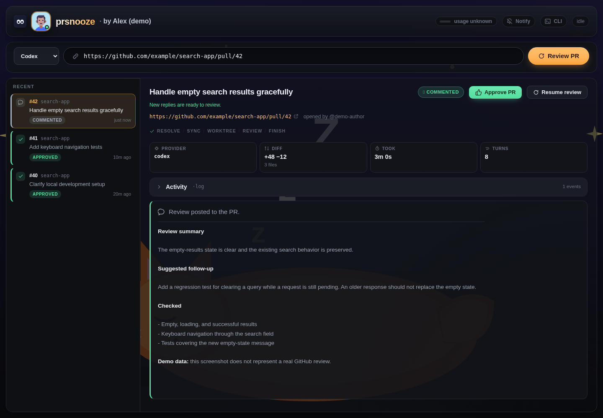

# PRSnooze

**Review GitHub pull requests with Claude Code or Codex, from a web page or your terminal.**

Run PRSnooze on your computer or a trusted team machine. Paste a PR link, choose
Claude or Codex, and watch the review run. The agent reads the code in a separate
checkout, follows the project's review rules, and posts its findings to GitHub.

Already have a teammate running it? Use the **`snooze` CLI** to find an available
reviewer, submit a PR, and resume the review after fixes. You don't need to run
your own server or install either AI provider for that.



*Current interface with fictional demo reviews. No private repositories or real account data.*

[Start a server](#start-a-server) · [Use the CLI](#use-the-cli) · [Docker](#run-with-docker) · [Settings](#settings) · [Operating guide](docs/usage.md)

## What you can do

- **Choose Claude or Codex for each review.** Use either one, or install both and switch in the page or CLI.
- **Review without leaving your terminal.** Add several PRSnooze servers, see which has capacity, and choose where to send work.
- **Follow the review live.** See commands, findings, and the final result in the browser.
- **Continue after fixes.** Resume a saved review with the same provider and session.
- **Use your project's rules.** PRSnooze reads repository review skills and guidance, with a bundled fallback when none exists.
- **Control your server.** Set a profile picture, enable or disable providers, pause new work, and choose one to four simultaneous reviews.

PRSnooze has no separate AI service fee. Reviews use the host's configured
provider account and consume its quota or API budget. Review time depends on
the PR, provider, and available capacity. AI review can miss issues; keep your
normal human review and branch protection rules.

## Before you start

**Use a trusted private network, not the public internet.** Anyone who can reach
the page can request a review. Settings and approval passwords do not protect
access to the whole page.

Reviews run under the **server owner's GitHub identity** and use **that owner's
Claude or Codex account**. The AI runs without permission prompts or a sandbox
and can execute commands with the server process's permissions. A separate
checkout is not a security sandbox. Use a dedicated, restricted account or
machine and only review repositories you trust.

Code is checked out on the host, and relevant code and prompts are sent to the
selected AI provider. Do not use it for code your organization does not allow
that provider to process. Restrict GitHub credentials to the repositories and
permissions needed. Use HTTPS or an encrypted private connection such as
Tailscale when sharing the service.

## Start a server

These commands are for a macOS or Linux shell. For a container-based setup,
see [Docker](#run-with-docker).

### 1. Install the prerequisites

You need [Node.js](https://nodejs.org/en/download) **20 or newer**, [Git](https://git-scm.com/downloads),
[GitHub CLI (`gh`)](https://cli.github.com/), and **at least one** AI provider:

| Reviewer | Install and sign in |
|---|---|
| Claude Code | Follow the [Claude Code quick start](https://code.claude.com/docs/en/quickstart), then run `claude` and finish signing in. |
| Codex | Run `npm install -g @openai/codex`, then `codex login`. See the [Codex CLI guide](https://developers.openai.com/codex/cli/). |
| Both | Complete both rows. Each review uses the provider you select. |

Sign in to GitHub with the account that should post the reviews:

```sh
gh auth login
gh auth status
```

That account needs access to the repositories being reviewed and permission to
post PR reviews. PRSnooze clones over HTTPS using its GitHub credentials by default;
an SSH key is not required.

### 2. Download and configure PRSnooze

```sh
git clone https://github.com/mahsanamin/prsnooze.git
cd prsnooze
npm ci
cp .env.example .env
```

Open `.env` in your editor. Set these two lines for the providers you signed into:

| Your setup | `REVIEW_PROVIDERS` | `DEFAULT_REVIEW_PROVIDER` |
|---|---|---|
| Claude only | `claude` | `claude` |
| Codex only | `codex` | `codex` |
| Both | `claude,codex` | `claude` or `codex` |

For example, a Codex-only setup is:

```dotenv
REVIEW_PROVIDERS=codex
DEFAULT_REVIEW_PROVIDER=codex
```

Using nvm? Run `nvm install` and `nvm use` inside this folder before `npm ci`.
The repo also includes `.tool-versions` for asdf and mise; configure your
manager's Node.js plugin or backend first, then run `asdf install` or `mise install`.

### 3. Start it

```sh
npm start
```

Startup checks the tools and logins and prints the address. On the computer
running PRSnooze, open **http://localhost:8284** unless you changed `PORT`.
From another computer, use the server's private hostname or IP with that port,
not `localhost`. Allow access only from your trusted network.

Paste an **open GitHub PR URL**, choose the provider if both are enabled, and
click **Review PR**. Watch the result in the page and follow its link to GitHub.
Low-risk, clean PRs may receive an approval. To require comments only from
automated reviews, set `AUTO_APPROVE=false` in `.env` before starting.

Keep this terminal open. Press **Ctrl+C** to stop it.

### Keep it running after closing the terminal

Once the first review works, stop the foreground process when no reviews are
running, then install the background service:

```sh
bin/prsnooze-service install
bin/prsnooze-service status
bin/prsnooze-service logs -f
```

This uses launchd on macOS or systemd on Linux. The machine must stay awake.
See the [service guide](docs/usage.md#keep-it-running) for login, reboot, and
macOS keychain considerations.

## Use the CLI

The **`snooze` CLI** lets you use your own server or a teammate's server without
opening a browser. A client-only computer needs Node.js and this repository;
the **server** needs GitHub and provider logins.

If you have not downloaded the repo yet, clone it and run `npm ci` as above.
Then, inside the PRSnooze folder:

```sh
# Register a server once. Replace this example URL with the real private URL.
bin/snooze add http://review-box:8284 --name team

# List your servers and see which have room for another review.
bin/snooze reviewers
bin/snooze status

# Replace this example PR URL with your own open PR.
bin/snooze review https://github.com/OWNER/REPO/pull/123 --peer team --provider codex
```

Use `--provider claude` to choose Claude. Omit `--peer` to let the CLI select an
available server from your saved list. Omit `--provider` to use the chosen
server's default. Submitting queues a real review and prints whose account
will post it, along with a review reference and browser URL.

Use the **reference printed by the review command** for follow-up commands:

```sh
bin/snooze job INSTANCE_ID/JOB_ID
bin/snooze resume INSTANCE_ID/JOB_ID
```

Resume checks for new commits or replies and uses the original server and
provider. It refuses merged or closed PRs. Run `bin/snooze help` for all options,
including `--json` for scripts and `status --usage` for supported plan information.

Want the short command from any directory? Run **`npm link`** once from the repo
with your user-managed Node installation. Then use `snooze` instead of
`bin/snooze`. If linking is unavailable, the repository-local command still works.

Most instances need no CLI token. If the owner configured `PRSNOOZE_REMOTE_TOKEN`,
use `bin/snooze token YOUR_SHARED_TOKEN` as directed by that owner. That token
protects only the remote CLI API, not the web page. [More CLI details](docs/usage.md#reach-your-teams-other-instances-from-the-terminal).

## Run with Docker

Install Docker with Compose, clone this repo, and open its folder. Docker
bundles Node.js, Git, GitHub CLI, Claude Code, and Codex.

```sh
cp .env.example .env
# Edit REVIEW_PROVIDERS and DEFAULT_REVIEW_PROVIDER as shown above.
bin/docker-server start
bin/docker-server gh-login
```

Sign in to the provider you chose, or run both commands if using both:

```sh
bin/docker-server claude-login
bin/docker-server codex-login
```

Follow each login prompt, then open **http://localhost:8284** on the Docker
host, or its private address from another computer. Check with
`bin/docker-server status`; view logs with `bin/docker-server logs`.
The container runs in the background. Logins and review history persist in
Docker volumes. Docker must be running for the service to be available.

## Settings

Click the **profile picture beside the logo** to open settings. To allow edits,
set `PRSNOOZE_SETTINGS_PASSWORD` in `.env` and restart the local server. Docker
users must also [pass the setting into the container](docs/usage.md#docker-settings-beyond-the-provider-selection). There is no
default password. Settings unlock for eight hours in the current browser tab
after the first successful save; the browser stores a temporary token, not
your password.

The menu lets you choose or upload a picture, enable or disable Claude and
Codex, pause new reviews, change concurrency, and set a minimum remaining
Claude plan percentage. Codex plan limits are not reported by this integration,
so that percentage does not apply to Codex. Claude reviews are refused while
the detected model is Fable.

Manual PR approval uses a **different** password, `MANUAL_APPROVE_PASSWORD`,
and still refuses unresolved blocking findings. Neither password is a general
login for the web page. See [configuration](docs/usage.md#configuration) and
[approval rules](docs/usage.md#approving-by-hand).

## Update an existing installation

Wait until no reviews are running. From the repo folder:

```sh
git pull --ff-only
npm ci
bin/prsnooze-service restart
```

For a foreground process, stop it with Ctrl+C and run `npm start` again instead
of the service restart. For Docker, run `git pull --ff-only` then
`bin/docker-server rebuild`; host-side `npm ci` is not needed.
Running `npm start` while another instance is up does **not** replace that process.

## Help and details

- **Startup fails:** run `npm run check` and fix the failed tool or login check.
- **Codex-only setup fails on Claude:** set both provider variables as shown above.
- **Settings are read-only:** set the settings password and restart the backend.
- **Review says Commented and Merged:** Commented is what that review posted; Merged is the PR's later GitHub state. Merging does not rewrite the earlier review.
- [Service, configuration, review policy, and troubleshooting](docs/usage.md)
- [Provider adapter design](docs/provider-adapters.md)
- [Contributing and validation](AGENTS.md)

## License

[MIT](LICENSE). Bundled avatars: [DiceBear Personas by Draftbit](https://www.dicebear.com/styles/personas/), CC BY 4.0.
