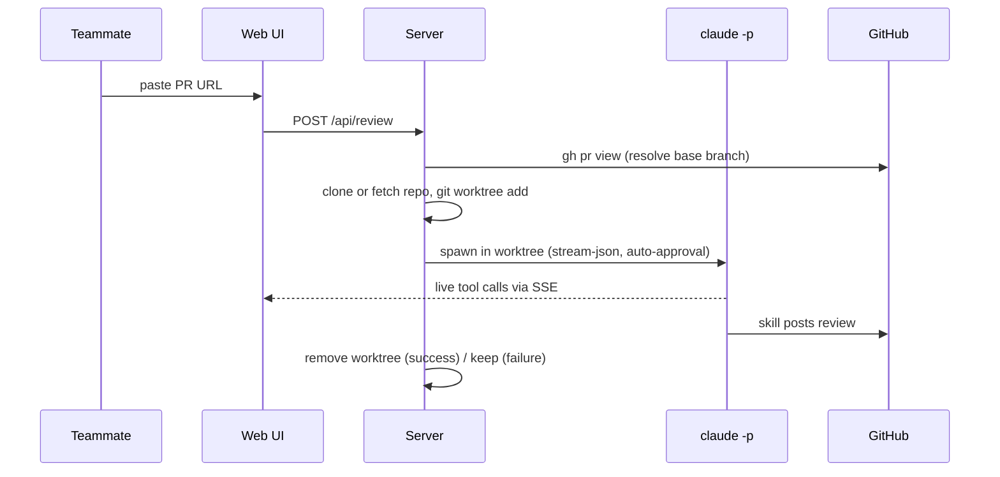

# prsnooze

> 👀 You snooze. It reviews. A browser-based PR reviewer that runs Claude Code headlessly on your machine.

A teammate pastes a GitHub PR URL into a web form. The host machine — already logged into Claude Code, `gh`, and SSH — clones the repo, makes a fresh worktree from the PR's base branch, runs `claude -p` with the project's review skill, streams the live tool calls to the browser, and posts review comments back to GitHub. While you sleep.

---

## ⚠️  Read this first — safety

prsnooze runs **`claude --dangerously-skip-permissions`**. That means:

- Claude has full file, network, and tool access in the worktree with **no confirmation prompts**.
- Anyone who can reach the web UI can trigger a Claude session on your machine.
- The host's `gh` identity is who posts reviews on GitHub. Anyone using prsnooze is effectively reviewing-as-you.

To run this safely:

1. **Don't expose the web UI to the public internet.** Bind to LAN or Tailscale. There is no auth.
2. **Use a fine-grained GitHub PAT**, not a classic admin token, scoped to:
   - the specific repos you want reviewed,
   - "Pull requests: Read and write" + "Contents: Read".
   Set it via `gh auth login` (pick "Token") or environment variable.
3. **Vet the review skill.** `aa-review-pr` / `review-pr` is what actually reads code and posts comments. Read it before trusting it.
4. **Run on a machine you don't mind issuing networked actions on your behalf.**

**Use at your own risk.**

---

## How it works



Project-level rules are honored automatically: the worktree is a full checkout, so `CLAUDE.md`, `AGENTS.md`, `.claude/skills/`, and `.claude/settings.json` from the repo are picked up by Claude Code as usual. The prompt explicitly nudges Claude to follow them.

---

## Two ways to run

### Local quickstart (no Docker)

```sh
git clone https://github.com/<you>/prsnooze.git
cd prsnooze
npm install
npm start
```

`npm start` runs preflight checks (Node, git, claude, claude login, gh, gh auth, GitHub SSH, data dir writable), prints the safety warning, and starts the server.

Data lives in `~/.prsnooze/` (clones, worktrees, job state) — out of the project tree.

### Docker (recommended for shared deployments)

The Docker image bundles `node`, `git`, `gh`, and Claude Code — colleagues can deploy without setting up any of those locally.

```sh
git clone https://github.com/<you>/prsnooze.git
cd prsnooze

bin/docker-server start          # build + start in background
bin/docker-server claude-login   # one-time: complete Claude OAuth
bin/docker-server gh-login       # one-time: gh auth (use a fine-grained PAT)
```

Then visit **http://localhost:8284**.

| Command | Purpose |
|---|---|
| `bin/docker-server start` | build (if needed) + start in background |
| `bin/docker-server stop` | stop the container |
| `bin/docker-server restart` | restart without rebuild |
| `bin/docker-server rebuild` | rebuild image, recreate container |
| `bin/docker-server ssh` | drop into a bash shell inside the container |
| `bin/docker-server claude-login` | run `claude` interactively to log in |
| `bin/docker-server gh-login` | run `gh auth login` |
| `bin/docker-server logs` | tail container logs |
| `bin/docker-server status` | show container status |
| `bin/docker-server url` | print the listen URL |

Each is also available as `npm run docker:<command>`.

Auth and data persist in named docker volumes (`prsnooze-claude`, `prsnooze-gh`, `prsnooze-data`) — `rebuild` does **not** wipe your login or your cached repos. To reset everything:

```sh
docker compose down -v
docker volume rm prsnooze-claude prsnooze-gh prsnooze-data
```

---

## Requirements

| | Local | Docker |
|---|---|---|
| Node.js ≥ 20 | host needs it | bundled |
| `claude` CLI + login | host needs it | bundled, log in via `docker-server claude-login` |
| `gh` CLI + auth | host needs it | bundled, log in via `docker-server gh-login` |
| git + SSH | host needs it (SSH for clones) | bundled, but uses HTTPS via gh token |
| Review skill | `~/.claude/skills/aa-review-pr` (or `review-pr`) | same — persists in the `prsnooze-claude` volume |

---

## GitHub authentication

prsnooze posts reviews **as the user the host is logged in as**. Use the smallest credential that works:

- **Recommended: fine-grained Personal Access Token** (https://github.com/settings/personal-access-tokens). Scope to the specific repos you want reviewed, with:
  - **Pull requests: Read and write** (post review comments)
  - **Contents: Read** (read the diff)
- Set via `gh auth login` → choose "Paste an authentication token" and paste the PAT.
- Avoid **classic** PATs unless you can't help it — they grant access to all your repos.

If you use SSH for cloning (local mode), make sure your SSH key is registered: https://github.com/settings/keys.

---

## Configuration

Defaults are in `.env.example`. Anything in `.env` overrides them.

| Variable | Default | Purpose |
|---|---|---|
| `PORT` | `8284` | HTTP port |
| `PRSNOOZE_HOME` | `~/.prsnooze` | Root for repos / worktrees / outputs |
| `REPOS_DIR` | `$PRSNOOZE_HOME/repos` | Where repos are cloned |
| `WORKTREES_DIR` | `$PRSNOOZE_HOME/worktrees` | Where worktrees are added |
| `OUTPUTS_DIR` | `$PRSNOOZE_HOME/outputs` | Where job state is persisted |
| `KEEP_WORKTREES_ON_SUCCESS` | `false` | If `true`, keep worktrees after a successful review |
| `CLAUDE_BIN` | `claude` | Path to the claude CLI |
| `HERO_IMAGE` | `/heroes/sleepy-cat.svg` | Landscape image on the home page (path or URL) |

### Customizing the hero image

Three SVG defaults ship in `public/heroes/`:

| Path | Style |
|---|---|
| `/heroes/sleepy-cat.svg` | Orange tabby curled up under a starry sky (default) |
| `/heroes/pink-panther.svg` | Smug pink long-cat. "cool. calm. reviewing." |
| `/heroes/moon-night.svg` | Crescent moon with stars and rolling hills |

To use one: `HERO_IMAGE=/heroes/pink-panther.svg` in `.env`.

To use **your own**: drop a JPEG/PNG/SVG into `public/heroes/` and point at it (`HERO_IMAGE=/heroes/my-cat.jpg`), or use any public URL (`HERO_IMAGE=https://i.example.com/my-banner.jpg`). Aim for a landscape aspect ratio (~16:7 or wider).

---

## Concurrency

One review at a time. Additional submissions queue FIFO. The topbar shows current queue depth.

## File layout

| Path | Purpose |
|---|---|
| `bin/start.js` | Local preflight + bootstrap |
| `bin/docker-server` | Docker dispatcher (start/stop/ssh/login/etc) |
| `Dockerfile` / `docker-compose.yml` | Container definition |
| `server.js` | Express app, SSE, queue wiring, `.env` loader |
| `lib/queue.js` | Single-worker FIFO with EventEmitter |
| `lib/review-job.js` | Per-job orchestrator |
| `lib/git-ops.js` | `gh repo clone`, `git fetch`, `git worktree add/remove` |
| `lib/github.js` | PR URL parser + `gh pr view` wrapper |
| `lib/claude-runner.js` | Spawns `claude -p`, parses stream-json |
| `public/` | UI (vanilla JS + EventSource) |
| `~/.prsnooze/` (host) or `prsnooze-data` volume (docker) | Runtime state |

## Troubleshooting

- **`gh pr view failed`** — run `gh auth status` (or `bin/docker-server ssh` then `gh auth status`).
- **`Base branch not found on origin`** — the PR's base branch was deleted, or the cached clone is stale. prsnooze fetches before every worktree, so it usually means the branch really is gone.
- **Claude exits non-zero** — the worktree is preserved at `~/.prsnooze/worktrees/<jobId>` (or in the container at `/home/prsnooze/.prsnooze/worktrees/<jobId>`). `cd` in and run `claude` interactively to reproduce.
- **Skill not picked up** — confirm `aa-review-pr` (or `review-pr`) is in `~/.claude/skills/` (user level) or the project's `.claude/skills/`. The prompt names both.

## Roadmap

- GitHub webhook (auto-trigger on PR open)
- Optional bearer-token auth on the web UI
- Persistent queue (survive restart)
- Pluggable skill names via env

## License

[MIT](LICENSE).
