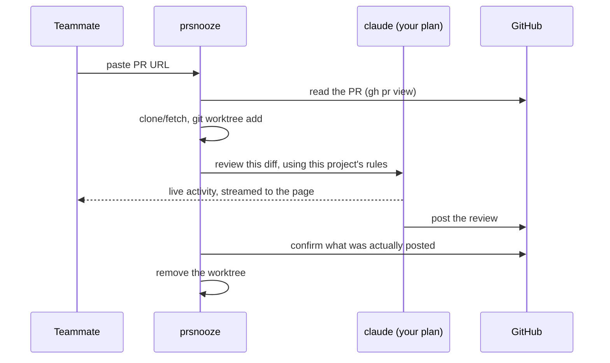

# prsnooze

> **Paste a PR link. Get a real review on GitHub about a minute later.** Nobody had to be asked.


## The problem

Your PR is ready. You drop it in Slack: *"anyone free to review this?"*

Then you wait. Not because the review is hard — because getting a person's attention is hard. They're in a meeting, heads-down, or asleep. A ten-minute review takes half a day to *start*.

## What prsnooze is

One person on your team runs prsnooze on their machine. It's a web page.

Anyone on your network opens that page, pastes a GitHub PR URL, and clicks **Review PR**. A minute later the review is on the PR — specific comments about the actual diff, posted under that person's GitHub account. If the change is genuinely small and safe, it approves it outright.

| Before | After |
|---|---|
| "Can someone review my PR?" → wait | Paste the link. Done. |
| Hours before the first look | First-pass review in about a minute |
| Your reviewer context-switches out of their work | Your reviewer isn't interrupted at all |
| Review quality depends on who's free | Every review runs the same playbook — your project's own |

## Why not just buy a review bot

**Because your team is already paying for Claude, and that budget is sitting idle.**

prsnooze doesn't have its own account, key, or bill. It drives the `claude` CLI that the host is *already logged into* — their existing subscription, on their own machine. Nothing new to buy, no per-PR metering, no finance conversation.

It's also not an autonomous agent wandering your repos. It runs when a human asks, on the one PR they named, and stops. You can watch every command it runs, live.

| | A hosted review bot | prsnooze |
|---|---|---|
| Cost | org API key, billed per PR | nothing extra — uses the Claude plan you already have |
| Runs when | on every push, whether you wanted it or not | when someone pastes a link |
| Reviews against | its own generic idea of "good code" | your project's `.claude/skills/review-pr` |
| Your code goes | to a third-party service | nowhere — it's your teammate's laptop |

## Try it in two minutes

```sh
git clone https://github.com/mahsanamin/prsnooze.git
cd prsnooze
npm install
npm start
```

`npm start` checks your setup, tells you anything that's missing, and prints a URL — by default **http://localhost:8284**. Open it, paste a PR link, watch it work.

That's the whole thing. To let colleagues use it, share that URL over your LAN or Tailscale — but read the next section first.

## ⚠️ Read this before you share the URL

prsnooze runs `claude --dangerously-skip-permissions`. That means:

- Claude can read, write and run anything inside the checkout, with no confirmation prompts.
- **Anyone who can reach the page can start a Claude session on your machine.**
- Reviews are posted as *you*. Anyone using it is reviewing under your GitHub identity.

So:

1. **Don't put it on the public internet.** LAN or Tailscale only. There is no login on the page.
2. **Use a fine-grained GitHub token** scoped to the repos you actually want reviewed (Pull requests: read+write, Contents: read). Not a classic all-repos token.
3. Run it on a machine you don't mind seeing network activity from.

## Everyone can see what's left of your plan

Reviews come out of one person's Claude subscription, so the top bar shows how much of it is still there — **82% left · session** — coloured green, amber or red. Click it for every limit window, what's used, what's left, and when each one resets.

It's deliberately visible to everyone, not just the host: whoever is about to paste a PR link is the person spending the plan, and "the session limit resets at 9pm" is a much better answer than a review that mysteriously fails. The numbers come from the CLI's own `/usage` report, which costs nothing to ask for — no tokens, no API call.

The same panel ends with a month-to-date total — *6 reviews · ≈$11.49 at API rates* — read from prsnooze's own review history. That one is a total, not a limit: Claude's plan resets by session and by week, so there's no monthly tank to run dry. It's there to answer "how much has this thing actually eaten of my plan this month".

If the host's `claude` runs on an API key instead of a subscription there are no plan windows to report, and the meter simply doesn't appear.

## The model doing the reviewing is on screen

prsnooze never picks a model: every review runs on whatever the host's `claude` CLI is set to. So the top bar says which one — **Opus 5 · 1M context** — read from the CLI's own `/model` output, which costs nothing to ask for and is the live setting rather than a config value someone wrote down once.

It's there because it's the shortest explanation of how a review reads: the same PR comes back very differently on Haiku than on Opus. Each finished review also keeps the model it actually ran on in its stats, so a review from last month still tells you what read that diff after the host has moved on to something else. Changing it is a host-side thing — `/model` in their CLI, not a control on this page.

## What it does, step by step



Because it reviews inside a real checkout of your repo, your `CLAUDE.md`, `AGENTS.md` and `.claude/skills/` are all picked up automatically.

## When it approves on its own

Auto-approve (`AUTO_APPROVE=true`, the default) fires only when **all** of these hold:

1. The reviewer found no critical and no major issues.
2. Its **risk score** for the diff is ≤ 20.
3. Nothing in the diff looks like a real behaviour change in a scary place.

How the score works — the reviewer looks for genuine behaviour changes, not just scary-looking filenames (a typo fix in an auth file is not an auth change):

| Signal | Score |
|---|---|
| Auth / payments / DB migration — real behaviour change | +50 each |
| CI/CD change, public API break | +30 each |
| Real refactor, or a new public endpoint | +20 each |
| Dependency bump — major / minor / patch | +25 / +10 / +2 |
| Unclear blast radius | +15 |
| *Comments, formatting or renames only* | −25 |
| *Tests or docs only* | −20 |
| *Matching test file also changed* | −15 |
| *New tests covering the changed paths* | −10 |

| Total | What it does |
|---|---|
| ≤ 20 | approves |
| 21 – 60 | comments |
| > 60 | comments, with a high-risk banner |

If auth, payments or a migration really changed, the reducers are capped at −20 — so a genuine top-3 change never auto-approves. When it can't tell, it comments. Set `AUTO_APPROVE=false` and it never approves anything.

## Reviews follow your project's rules

prsnooze looks for a review playbook in this order and uses the first it finds:

1. `<repo>/.claude/skills/review-pr/SKILL.md` — **your project's own**
2. `~/.claude/skills/review-pr/SKILL.md` — the host's personal one
3. `skills/default-review/SKILL.md` — bundled here, so there's always a floor

(`aa-review-pr` works as an alternate name at both levels.) The page shows which one ran, tagged `[project]` / `[user]` / `[bundled]`. To make reviews match how your team actually reviews, drop a `review-pr/SKILL.md` into your repo — nothing else to configure.

## Someone replied to the review — now what

Open the finished review and press **Resume review**. It continues the *same* Claude session, so it already knows what it said the first time, and re-checks the current state: new commits, and replies to its own comments. Each earlier point comes back as **addressed**, **answered** (the author was right — it concedes), or **still open**.

A resume can approve. Once nothing is left open, it re-scores the current head against the same table above and posts the verb that comes out, so a small PR whose findings the author fixed gets approved instead of sitting there forever. Fixing the findings doesn't buy down the score, though: a change that touches auth, a migration or CI/CD is still high-risk after the fixes land, so it comments again and the merge call stays with you.

Before it runs, it checks whether that's worth doing and tells you: *"2 new commits and 3 replies to your comments since your review."* If there's nothing new, or the PR is already approved, it says so — **Force resume** runs it anyway. On a merged or closed PR, force is disabled: there's no PR left to review.

## Setup, properly

| | Local | Docker |
|---|---|---|
| Node.js ≥ 20 | you need it | bundled |
| `claude` CLI, logged in | you need it | bundled — `bin/docker-server claude-login` |
| `gh` CLI, authenticated | you need it | bundled — `bin/docker-server gh-login` |
| git + SSH key | you need it | bundled (uses the gh token over HTTPS) |

Docker is the easier route for a machine several people will use, since it brings its own `node`, `git`, `gh` and Claude Code:

```sh
bin/docker-server start          # build + run in the background
bin/docker-server claude-login   # once: sign in to Claude
bin/docker-server gh-login       # once: gh auth (paste a fine-grained PAT)
```

Then open **http://localhost:8284**. Other commands: `stop`, `restart`, `rebuild`, `logs`, `status`, `ssh`, `url` — all but `url` also work as `npm run docker:<command>`. Logins and cached repos live in docker volumes, so `rebuild` doesn't sign you out.

Runtime data (clones, worktrees, past reviews) lives in `~/.prsnooze/`, outside the project.

## Configuration

Everything has a working default. Copy `.env.example` to `.env` only if you want to change something.

| Variable | Default | What it does |
|---|---|---|
| `PORT` | `8284` | HTTP port |
| `AUTO_APPROVE` | `true` | Allow it to approve clean, low-risk PRs. `false` = always just comment. |
| `MAX_CONCURRENT_REVIEWS` | `1` | Reviews at once. Extra submissions queue. |
| `CONFIDENCE_THRESHOLD` | `80` | Drop findings below this confidence. `0` = show everything. |
| `SKIP_IF_ALREADY_REVIEWED` | `true` | Don't re-review a commit you've already reviewed. |
| `PRSNOOZE_ADMIN_PASSWORD` | *unset* | Enables the manual **Approve PR** button (see below). |
| `PRSNOOZE_HOME` | `~/.prsnooze` | Where clones, worktrees and review history live. |
| `CLAUDE_BIN` | `claude` | Path to the claude CLI, if it isn't on `PATH`. |
| `KEEP_WORKTREES_ON_SUCCESS` | `false` | Keep the checkout after a successful review (for debugging). |
| `HERO_IMAGE` | *unset* | Optional background image. Unset, the page draws its own night sky. |

## Approving by hand

Risky or large PRs come back as *commented* on purpose — the merge decision stays with a human. On any finished review there's an **Approve PR** button, gated by a shared password so it works over a proxy as well as on localhost.

Set `PRSNOOZE_ADMIN_PASSWORD` to switch it on. There is no default: leave it unset and the button still shows, but clicking it just tells you the host hasn't enabled approving — the server refuses the call outright. The password is only ever checked on the server; unlocking sets a signed one-hour cookie per browser. Five wrong guesses from one IP locks the endpoint for a minute, doubling up to 30 — a shared password on a page your team can reach is otherwise guessable at network speed. You can't approve your own PR; GitHub wouldn't allow it anyway.

## When something goes wrong

- **`gh pr view failed`** — run `gh auth status`. This is the most common one.
- **`PR is merged, not OPEN`** — it only reviews open PRs.
- **Claude exited non-zero** — the checkout is kept at `~/.prsnooze/worktrees/<job-id>`. `cd` in and run `claude` there to see what happened.
- **Every review suddenly fails** — check the usage chip in the top bar first. A spent plan limit looks exactly like a broken tool.
- **The review feels generic** — it fell back to the bundled playbook. Add a `review-pr/SKILL.md` to your repo; the page tells you which one it used.

## License

[MIT](LICENSE)
