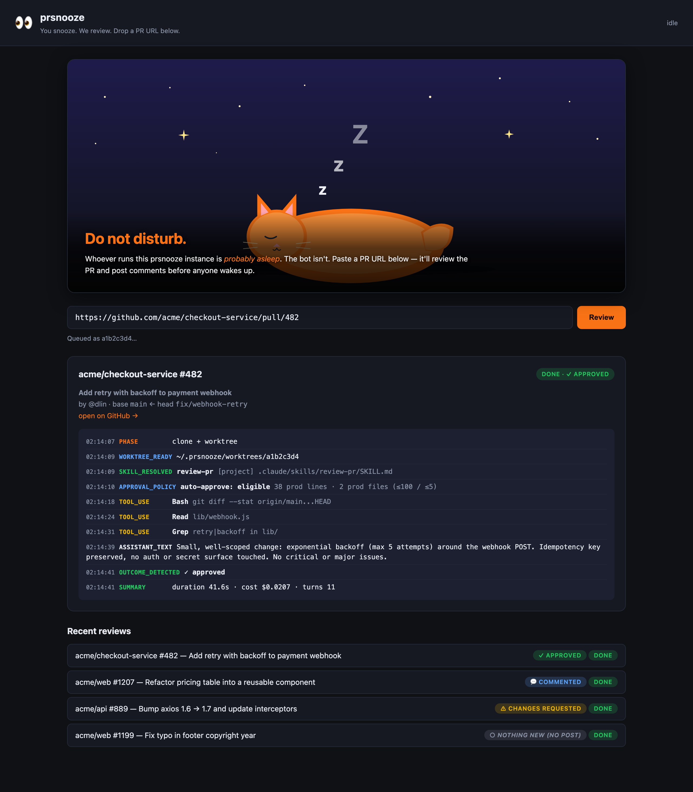
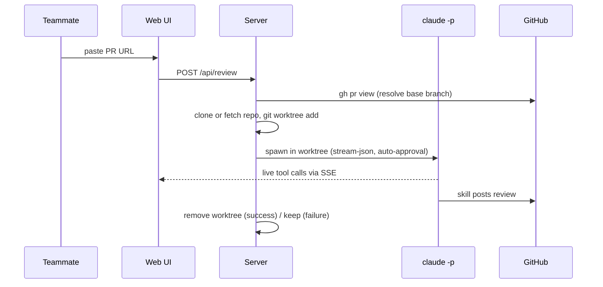

# prsnooze

> 👀 You snooze. It reviews. Get your PR reviewed without pinging a single human.



## What is this?

**prsnooze is an always-on PR reviewer that runs on a teammate's machine.**

Your PR is ready and you want eyes on it. The usual move is to ping someone: "can you review this?" But they are in a meeting, heads-down, or asleep. Your PR waits.

With prsnooze you skip the ask entirely. You open your teammate's prsnooze page, paste your PR URL, and hit **Review**. It clones the repo, reads the diff, reviews it against *that project's own review standards*, and posts the review comments straight back to the GitHub PR. As them. While they sleep.

Under the hood it runs **Claude Code headlessly** on the host machine (already logged into `claude`, `gh`, and git), so the review is a real agentic read of the code, not a regex linter.

## The shift

| Before | After |
|---|---|
| "Hey, can you review my PR when you get a sec?" | Paste the PR URL into prsnooze. Done. |
| Wait hours for a human to be free | First-pass review posted in under a minute |
| Reviewer context-switches out of their work | Reviewer is asleep and never interrupted |
| Review quality depends on who's around | Every review runs the project's review playbook |

It does not replace a human approver on risky changes. It clears the queue of "this is probably fine, just give it a look" PRs so humans spend their attention where it matters. Small, clean, low-risk PRs can even be **auto-approved** (see [auto-approval](#how-auto-approval-decides)).

## How it works



Project rules are honored automatically. The worktree is a full checkout, so `CLAUDE.md`, `AGENTS.md`, `.claude/skills/`, and `.claude/settings.json` from the repo are picked up by Claude Code as usual, and the prompt explicitly nudges Claude to follow them.

## ⚠️ Read this first: safety

prsnooze runs **`claude --dangerously-skip-permissions`**. That means:

- Claude has full file, network, and tool access inside the worktree with **no confirmation prompts**.
- Anyone who can reach the web UI can trigger a Claude session on your machine.
- The host's `gh` identity is who posts reviews on GitHub. Anyone using prsnooze is effectively reviewing *as you*.

To run this safely:

1. **Do not expose the web UI to the public internet.** Bind it to your LAN or Tailscale. There is no built-in auth.
2. **Use a fine-grained GitHub PAT**, not a classic admin token, scoped to the specific repos you want reviewed, with "Pull requests: Read and write" plus "Contents: Read". Set it via `gh auth login` (pick "Token").
3. **Vet the review skill.** The review skill is what actually reads code and posts comments. Read it before trusting it.
4. **Run it on a machine you do not mind issuing networked actions on your behalf.**

**Use at your own risk.**

## Quickstart

### Local (no Docker)

```sh
git clone https://github.com/<you>/prsnooze.git
cd prsnooze
npm install
npm start
```

`npm start` runs preflight checks (Node, git, claude, claude login, gh, gh auth, GitHub SSH, data dir writable), prints the safety warning, and starts the server. Then open the URL it prints (default **http://localhost:8284**).

Runtime data lives in `~/.prsnooze/` (clones, worktrees, job state), kept out of the project tree.

### Docker (recommended for a shared deployment)

The image bundles `node`, `git`, `gh`, and Claude Code, so colleagues can deploy without installing any of those locally.

```sh
git clone https://github.com/<you>/prsnooze.git
cd prsnooze

bin/docker-server start          # build + start in background
bin/docker-server claude-login   # one-time: complete Claude OAuth
bin/docker-server gh-login       # one-time: gh auth (use a fine-grained PAT)
```

Then visit **http://localhost:8284**.

| Command | Purpose |
|---|---|
| `bin/docker-server start` | build (if needed) + start in background |
| `bin/docker-server stop` | stop the container |
| `bin/docker-server restart` | restart without rebuild |
| `bin/docker-server rebuild` | rebuild image, recreate container |
| `bin/docker-server ssh` | drop into a bash shell inside the container |
| `bin/docker-server claude-login` | run `claude` interactively to log in |
| `bin/docker-server gh-login` | run `gh auth login` |
| `bin/docker-server logs` | tail container logs |
| `bin/docker-server status` | show container status |
| `bin/docker-server url` | print the listen URL |

Each is also available as `npm run docker:<command>`.

Auth and data persist in named docker volumes (`prsnooze-claude`, `prsnooze-gh`, `prsnooze-data`), so `rebuild` does **not** wipe your login or cached repos. To reset everything:

```sh
docker compose down -v
docker volume rm prsnooze-claude prsnooze-gh prsnooze-data
```

## Requirements

| | Local | Docker |
|---|---|---|
| Node.js ≥ 20 | host needs it | bundled |
| `claude` CLI + login | host needs it | bundled, log in via `docker-server claude-login` |
| `gh` CLI + auth | host needs it | bundled, log in via `docker-server gh-login` |
| git + SSH | host needs it (SSH for clones) | bundled, uses HTTPS via gh token |
| Review skill | optional (bundled default used if none) | optional (bundled default used if none) |

## GitHub authentication

prsnooze posts reviews **as the user the host is logged in as**. Use the smallest credential that works:

- **Recommended: a fine-grained Personal Access Token** (https://github.com/settings/personal-access-tokens), scoped to the specific repos you want reviewed, with:
  - **Pull requests: Read and write** (post review comments)
  - **Contents: Read** (read the diff)
- Set it via `gh auth login`, choose "Paste an authentication token", and paste the PAT.
- Avoid **classic** PATs unless you have no choice. They grant access to all your repos.

If you clone over SSH (local mode), make sure your SSH key is registered: https://github.com/settings/keys.

## Configuration

Defaults live in `.env.example`. Anything in `.env` overrides them.

| Variable | Default | Purpose |
|---|---|---|
| `PORT` | `8284` | HTTP port |
| `PRSNOOZE_HOME` | `~/.prsnooze` | Root for repos / worktrees / outputs |
| `REPOS_DIR` | `$PRSNOOZE_HOME/repos` | Where repos are cloned |
| `WORKTREES_DIR` | `$PRSNOOZE_HOME/worktrees` | Where worktrees are added |
| `OUTPUTS_DIR` | `$PRSNOOZE_HOME/outputs` | Where job state is persisted |
| `KEEP_WORKTREES_ON_SUCCESS` | `false` | If `true`, keep worktrees after a successful review |
| `CLAUDE_BIN` | `claude` | Path to the claude CLI |
| `AUTO_APPROVE` | `true` | If `true`, the reviewer **approves** PRs that are small, clean, and low-risk. Otherwise the review is posted via `--comment`. |
| `AUTO_APPROVE_MAX_LINES` | `100` | Max **production** lines (`additions + deletions`, test files excluded). Over this, review-only. |
| `AUTO_APPROVE_MAX_FILES` | `5` | Max **production** files changed. Over this, review-only. |
| `CONFIDENCE_THRESHOLD` | `80` | Noise filter: findings below this confidence are dropped. The project's review skill takes precedence if it defines its own filter. Set `0` to disable. |
| `SKIP_IF_ALREADY_REVIEWED` | `true` | If your gh user already posted a review on the same commit SHA, skip without spawning Claude. Prevents accidental double-reviews on resubmits. |
| `HERO_IMAGE` | `/heroes/sleepy-cat.svg` | Landscape image on the home page (path or URL) |

### How auto-approval decides

Auto-approve fires (`gh pr review --approve`) only when **all** of the following hold:

1. `AUTO_APPROVE=true` in your config.
2. The PR is small **in production code**: `prodAdditions + prodDeletions ≤ AUTO_APPROVE_MAX_LINES` **and** `prodFiles ≤ AUTO_APPROVE_MAX_FILES`. Test files are filtered out before the count (see [test-file detection](#test-file-detection)). This is a server-side hard guard: the reviewer is told "do not approve" if either cap is exceeded, regardless of what it finds.
3. The reviewer found no critical and no major issues.
4. The reviewer sees **none** of these criticality red flags in the diff:
   - auth / authn / authz / sessions / tokens / credentials
   - payments / billing / money handling
   - DB schema, migrations, data-shape changes
   - CI/CD, build scripts, deployment configs
   - public-API removal or signature change
   - non-trivial refactor that changes call-site behavior
   - adding, removing, or version-bumping a dependency
   - anything where regression risk cannot be bounded from the diff

If any of the above fails, the review is still posted, just as `--comment` instead of `--approve`. The web UI shows whether auto-approval was eligible, blocked by size, or disabled, plus the prod/test breakdown.

#### Test-file detection

A file is classified as **test code** (and therefore excluded from the size cap) if its path matches any of:

- `tests/`, `test/`, `__tests__/`, `spec/`, `e2e/`, `cypress/`, `integration-tests/`, `src/test/`
- `*.test.{js,jsx,ts,tsx,mjs,cjs}`, `*.spec.{js,jsx,ts,tsx,mjs,cjs}`
- `*_test.go`
- `test_*.py`, `*_test.py`
- `*_spec.rb`
- `*Tests.{java,kt,scala,groovy}`, `*Test.{java,kt,scala,groovy}`, `*Spec.{java,kt,scala,groovy}`, `*IntegrationTests.{java,kt,scala,groovy}`

Everything else counts as production code. If your project uses a non-standard test layout, edit `TEST_PATH_PATTERNS` in `lib/github.js`.

### Customizing the hero image

Three SVG defaults ship in `public/heroes/`:

| Path | Style |
|---|---|
| `/heroes/sleepy-cat.svg` | Orange tabby curled up under a starry sky (default) |
| `/heroes/pink-panther.svg` | Smug pink long-cat. "cool. calm. reviewing." |
| `/heroes/moon-night.svg` | Crescent moon with stars and rolling hills |

To use one: set `HERO_IMAGE=/heroes/pink-panther.svg` in `.env`.

To use **your own**: drop a JPEG/PNG/SVG into `public/heroes/` and point at it (`HERO_IMAGE=/heroes/my-cat.jpg`), or use any public URL (`HERO_IMAGE=https://i.example.com/my-banner.jpg`). Aim for a landscape aspect ratio (~16:7 or wider).

## Review skills

prsnooze inlines a review skill's body into the prompt at runtime. (Claude Code can't reliably dispatch a skill marked `disable-model-invocation: true` via the Skill tool, so inlining is bulletproof.)

Resolution order, first hit wins:

1. `<worktree>/.claude/skills/aa-review-pr/SKILL.md` (project)
2. `<worktree>/.claude/skills/review-pr/SKILL.md` (project, alternate name)
3. `~/.claude/skills/aa-review-pr/SKILL.md` (your user-level skill)
4. `~/.claude/skills/review-pr/SKILL.md`
5. **`<prsnooze>/skills/default-review/SKILL.md`** (bundled with this repo)

The bundled default always exists, so it is the floor: every review runs a structured playbook, never a vibes-only "do a thoughtful review." It is built for headless use: no interactive prompts, severity-tagged findings, an explicit "post exactly once" guard, and compatibility with prsnooze's auto-approve policy.

To customize per project, drop a `review-pr/SKILL.md` (or `aa-review-pr/SKILL.md`) into your project's `.claude/skills/`. prsnooze picks it up automatically. The web UI's `skill_resolved` event tags the source as `[project]` / `[user]` / `[bundled]` so you can tell at a glance which playbook ran.

## Concurrency

One review at a time by default — additional submissions queue FIFO, and the topbar shows queue depth. To review several PRs at once, set **`MAX_CONCURRENT_REVIEWS`** to the number you want (e.g. `3`). Each review gets its own worktree and Claude session; only the quick per-repo git prep (`fetch` + `worktree add`) takes turns, so same-repo reviews never race on the shared clone.

## Manual approve (password-gated)

prsnooze deliberately doesn't auto-approve risky or large PRs — those come back as *commented*, leaving the merge decision to a human. A manual **✓ Approve PR** button appears on any finished review that wasn't auto-approved, gated behind a shared password so it works whether you're on `localhost` or reaching prsnooze through a reverse proxy.

**Setup:** set `PRSNOOZE_ADMIN_PASSWORD` in your env/`.env`. Leave it unset and approve is disabled entirely (the button explains it's off).

**How it works:**
- A **🔒 Locked** chip sits in the top bar. Click it (or a locked Approve button) to get a prompt for the admin password.
- The password is checked **server-side only** and never sent to the browser. On success the server sets a signed, `HttpOnly` cookie (a timestamped HMAC — no server-side session, survives restarts) and the browser is **🔓 Unlocked** for 1 hour.
- Unlock state is **per browser**: entering it in one browser doesn't unlock another, another machine, or an incognito window — each proves the password once. Cookies are also per-URL, so `localhost` and the proxy hostname unlock independently.
- While unlocked, **✓ Approve PR** runs `gh pr review <pr-url> --approve` server-side under this machine's `gh` login (so `gh` must be installed + authenticated — no token/PAT needed). Every approve re-verifies the cookie (`POST /api/jobs/:id/approve` → 401 if locked). It's disabled for a PR you (that `gh` identity) authored, and becomes **✓ Approved** once done.

Over the proxy you're on HTTPS, so the password is encrypted in transit; on plain `http://localhost` it never leaves your machine.

## File layout

| Path | Purpose |
|---|---|
| `bin/start.js` | Local preflight + bootstrap |
| `bin/docker-server` | Docker dispatcher (start/stop/ssh/login/etc) |
| `Dockerfile` / `docker-compose.yml` | Container definition |
| `server.js` | Express app, SSE, queue wiring, `.env` loader |
| `lib/queue.js` | Concurrency-capped worker pool with EventEmitter |
| `lib/repo-lock.js` | Per-repo serialization for git prep (safe concurrency) |
| `lib/review-job.js` | Per-job orchestrator |
| `lib/git-ops.js` | `gh repo clone`, `git fetch`, `git worktree add/remove` |
| `lib/github.js` | PR URL parser + `gh pr view` wrapper |
| `lib/skill-resolver.js` | Finds the review skill to inline |
| `lib/claude-runner.js` | Spawns `claude -p`, parses stream-json |
| `public/` | UI (vanilla JS + EventSource) |
| `~/.prsnooze/` (host) or `prsnooze-data` volume (docker) | Runtime state |

## Troubleshooting

- **`gh pr view failed`**: run `gh auth status` (or `bin/docker-server ssh` then `gh auth status`).
- **`Base branch not found on origin`**: the PR's base branch was deleted, or the cached clone is stale. prsnooze fetches before every worktree, so it usually means the branch really is gone.
- **Claude exits non-zero**: the worktree is preserved at `~/.prsnooze/worktrees/<jobId>` (or in the container at `/home/prsnooze/.prsnooze/worktrees/<jobId>`). `cd` in and run `claude` interactively to reproduce.
- **Review feels generic**: prsnooze searches for a project-level review skill in the worktree's `.claude/skills/`, then at `~/.claude/skills/`, then falls back to the bundled `skills/default-review/SKILL.md`. The `skill_resolved` event shows which one was used. For a project-specific rubric, add a `review-pr/SKILL.md` to your project.

## Roadmap

- GitHub webhook (auto-trigger on PR open)
- Optional bearer-token auth on the web UI
- Persistent queue (survive restart)
- Pluggable skill names via env

## License

[MIT](LICENSE).
